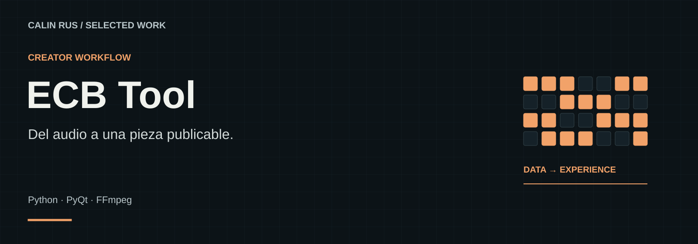
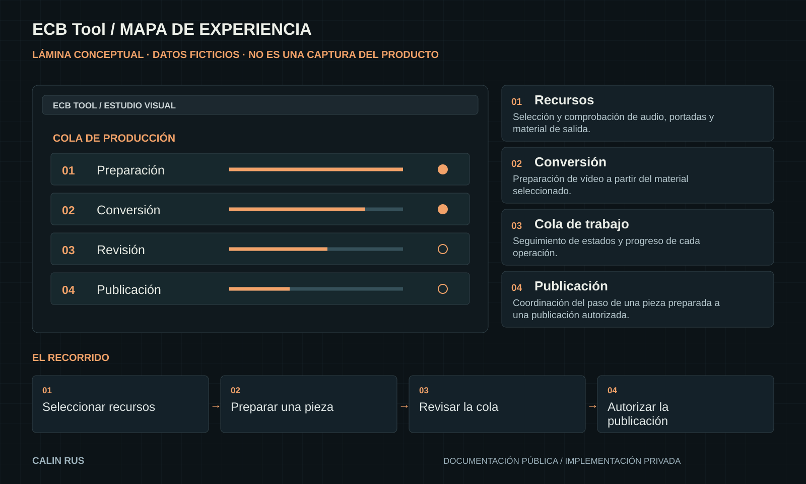

# ECB Tool

**Del audio a una pieza publicable.**

Una herramienta de escritorio para organizar recursos musicales, preparar vídeos y coordinar una cola de publicación.

**Stack:** Python · PyQt · FFmpeg  
**Estado:** Proyecto de escritorio · revisión documental

[Portfolio](https://github.com/calinrus-dev/portfolio) · [Experiencia](docs/EXPERIENCIA.md) · [Componentes](docs/COMPONENTES.md) · [Diseño técnico](docs/ARQUITECTURA.md) · [Demostraciones](docs/DEMOSTRACIONES.md) · [Estado](docs/ESTADO.md)

## El problema que aborda

Convertir pistas en piezas audiovisuales exige organizar audio, portadas y metadatos. ECB Tool explora un flujo visible para seguir cada trabajo y sus diferentes etapas.

## Qué compone la experiencia

- **Recursos.** Selección y comprobación de audio, portadas y material de salida.
- **Conversión.** Preparación de vídeo a partir del material seleccionado.
- **Cola de trabajo.** Seguimiento de estados y progreso de cada operación.
- **Publicación.** Coordinación del paso de una pieza preparada a una publicación autorizada.

*Lámina explicativa con datos ficticios. Su contenido también está disponible como texto en [Componentes](docs/COMPONENTES.md).*

## Decisiones que definen el proyecto

- **Estados visibles.** El usuario debe distinguir lo pendiente, lo activo y lo finalizado.
- **Preparar antes de enviar.** La generación del vídeo y su publicación son momentos distintos.
- **Identidad del creador protegida.** El escaparate no incluye sesiones, credenciales ni material musical privado.

## Explorar el caso

- [Experiencia y recorrido](docs/EXPERIENCIA.md): intención, interacción y criterios de revisión.
- [Componentes](docs/COMPONENTES.md): las piezas visibles y el papel de cada una.
- [Diseño técnico](docs/ARQUITECTURA.md): responsabilidades y compromisos de diseño.
- [Demostraciones](docs/DEMOSTRACIONES.md): qué enseñan las imágenes y cómo leer la evidencia.
- [Estado y siguientes pasos](docs/ESTADO.md): alcance actual, comprobaciones y trabajo pendiente.

## Sobre este repositorio

Caso de estudio público de un proyecto con implementación privada. Reúne documentación, diagramas e imágenes seleccionadas. El motor, las integraciones y los datos operativos se mantienen privados. Las piezas públicas seleccionadas indican su origen y alcance.

Revisión editorial: 28 de septiembre de 2026. Autor: [Calin Rus](https://github.com/calinrus-dev).

[Instagram @c4linrus](https://www.instagram.com/c4linrus/) · [LinkedIn / calinrus](https://www.linkedin.com/in/calinrus-dev/) · [Todos los proyectos](https://github.com/calinrus-dev/portfolio)
