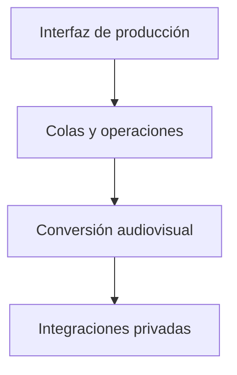

# ECB Tool / Diseño técnico

[← Inicio](../README.md)

## Contexto

Una herramienta de escritorio para organizar recursos musicales, preparar vídeos y coordinar una cola de publicación.

**Tecnologías asociadas al proyecto:** Python · PyQt · FFmpeg.

## Mapa de responsabilidades

Este mapa conceptual organiza la explicación del producto; no representa endpoints, procesos desplegados ni contratos internos.

## Estados visibles

El usuario debe distinguir lo pendiente, lo activo y lo finalizado.

## Preparar antes de enviar

La generación del vídeo y su publicación son momentos distintos.

## Identidad del creador protegida

El escaparate no incluye sesiones, credenciales ni material musical privado.

## Rendimiento y dependencia

Mi criterio de trabajo es medir antes de optimizar: identificar el recorrido relevante, observar tiempo de respuesta y uso de recursos y comparar cambios con la misma carga. En sistemas nativos también me interesa la disposición de datos, la localidad de memoria y el trabajo repetido.

Local-first es una preferencia arquitectónica: conservar una experiencia útil y control sobre los datos en el dispositivo, e incorporar servicios externos cuando aporten una función concreta. Su alcance varía por proyecto; no implica que todas las integraciones de este caso funcionen sin conexión.

No se publican cifras de rendimiento sin un ensayo identificado. La evidencia específica disponible está en [Estado](ESTADO.md).

## Qué conviene demostrar después

- Revalidar arranque, conversión y recuperación de cola.
- Preparar un vídeo de muestra con material autorizado.
- Actualizar la evidencia de funcionamiento antes de una distribución.
